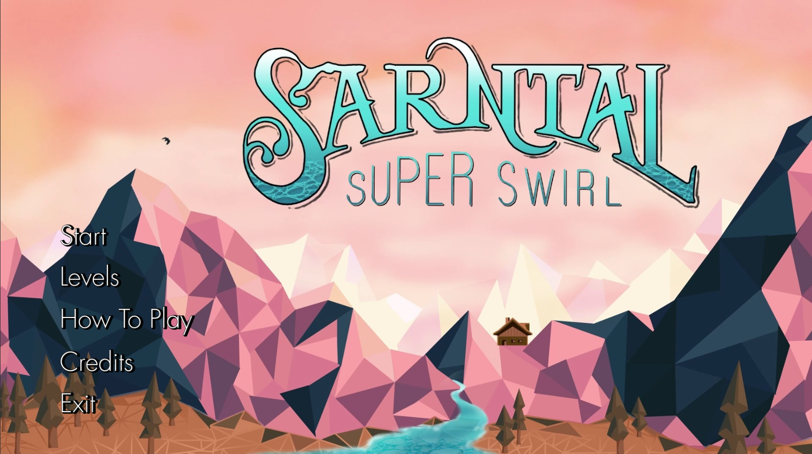
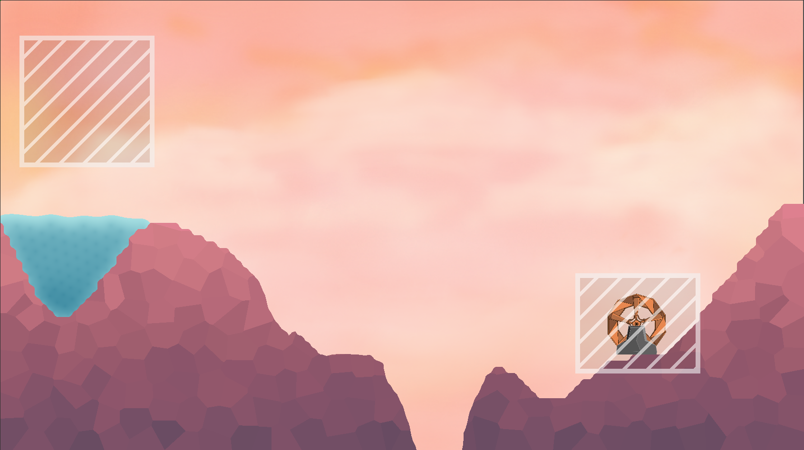
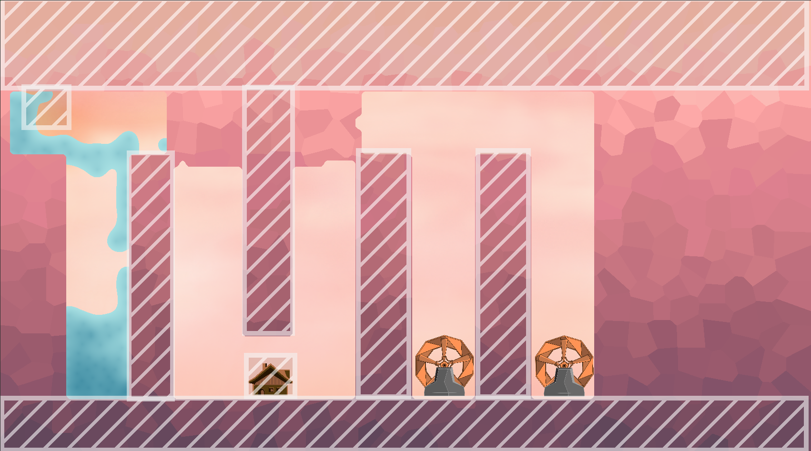

# course05

## Description
Sarntal Super Swirl is a short game that was created as coursework for Ferienakademie 2024 over a two-week period. It was developed by the team of [Course 05](https://ferienakademie.de/en/2024-course-5-lets-play-simulated-physics-for-games/).

## Project structure
<pre>
course05
├── cache
│   └── # compiled C++ bindings
├── gitlab_functions.sh # some functions for the GitLab CI
├── godot-cpp   # C++ bindings for the Godot script API 
├── project
│   ├── addons
│   │   └── # godot addons, e.g. Godot Unit Testing (GUT)
│   ├── bin
│   │   └── gdexample.gdextension
│   ├── build
│   │   └── # local build output
│   ├── cache
│   ├── export_presets.cfg  # Godot export configuration
│   ├── project.godot   # Godot project configuration
│   ├── reports
│   │   └── # results of local test runs
│   └── test
│       ├── integration
│       └── unit
├── screenshots
│   └── # game screenshots for README
├── README.md
├── SConstruct  # build file for C++
└── src
    └── # custom C++ libraries
</pre>

## Screenshots

If you have any questions regarding this project or ideas on improving it, feel free to contact me.
